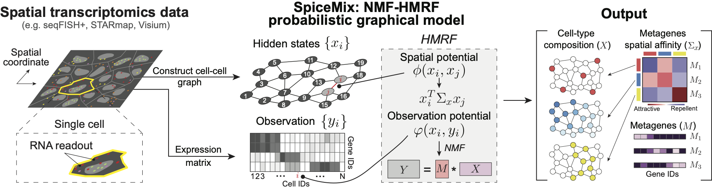

# SpiceMix



SpiceMix is an unsupervised tool for analyzing data of the spatial transcriptome. SpiceMix models the observed expression of genes within a cell as a mixture of latent factors. These factors are assumed to have some spatial affinity between neighboring cells. The factors and affinities are not known a priori, but are learned by SpiceMix directly from the data, by an alternating optimization method that seeks to maximize their posterior probability given the observed gene expression. In this way, SpiceMix learns a more expressive representation of the identity of cells from their spatial transcriptome data than other available methods. 

SpiceMix can be applied to any type spatial transcriptomics data, including MERFISH, seqFISH, and HDST.

## Requirement

- Python=3.7.3
- scipy=1.2.1
- psutil=5.6.3
- gurobi=8.1.1
- pytorch=1.0.1
- numpy=1.16.2
- scikit-learn=0.21.1

## Running SpiceMix

All code is contained within the SpiceMix folder. The script `main.py` runs the program -- see details for example usage.

### Step 1: preparing input files

All files for one run of SpiceMix must be put into one directory. For each FOV with name `<FOV>` of `N` cells and `G` genes, the following two files stored as tab-delimited txt format are required for SpiceMix:

- `expression_<FOV>_<expr_suffix>.txt`, an N-by-G nonnegative-valued matrix of normalized single-cell expression profiles. In our paper, we applied the following steps of normalization to all data sets:
  - Filter out genes with low nonzero rates and/or cells that express a few genes
  - Log transformation: Let  be the read counts of gene `g` in cell `i`, and the number of counts after log transformation is )
- `neighborhood_<FOV>_<neigh_suffix>.txt`, a neighbor graph represented as a list of cell pairs, i.e., an `|E|`-by-2 integer-valued matrix. Cells are assigned with integer indices starting from 0 in the order that they appear in the expression profile file. We recommend the following two methods to generate the neighbor graph from cells' spatial coordinates:
  - K-nearest neighbor graph under Euclidean metric
  - Delaunay triangulation followed by discarding interactions between cells that are far away from each other

When there are multiple isolated FOVs, the order of genes in `expression_<FOV>_<expr_suffix>.txt` for all FOVs must be identical.

The FOV name, denoted by `<FOV>` here, is required in order to distinguish between cells from different FOVs, especially when they don't share the same coordinate system. FOV names can be any string, including `1`, `cortex`, `mouse brain Oct-10-2020`.
To compare different normalizations and neighbor graphs, the two suffices, `<expr_suffix>` and `<neigh_suffix>`, can be used to distinguish between normalizations and neighbor graphs, respectively. For example, `neighborhood_3_KNN.txt` and `neighborhood_3_Delaunay.txt` may denote the neighbor graph generated by k-nearest neighbor and Delaunay triangulation, respectively.
The two suffices are optional, and the preceding underscore `_` should be absent when the corresponding suffix is an empty string.

The following data are used in downstream analysis and visualization:

- `genes_<FOV>_<expr_suffix>.txt`, multi-line file containing gene names or symbols with one gene per line. The order of genes should match that in `expression_<FOV>_<expr_suffix>.txt`.
- `celltypes_<FOV>.txt`Cells' spatial coordinates in the 2D or 3D space.

### Step 2: Organizing files

In the root directory, two directories should be created and named `scripts` and `data`. In the `data` directory, every data set of one or multiple FOVs should have its own directory, named by the name of the data set. In the directory of each data set, two directories, named `files` and `logs`, need to be created. The `files` directory contains input files prepared in step 1, and the `log` directory is initially empty.

For example, when there are two data sets, named `simulation 1` and `mouse primary visual cortex`, consisting of 3 and 2 FOVs, respectively, the file structure of Python scripts and input files should be as following:
```
.
├── SpiceMix
│   ├── main.py
│   ├── readData.py
│   └── ...
└── data
    ├── simulation 1
    |   ├── files
    |   |   ├── expression_1.txt
    |   |   ├── neighborhood_1.txt
    |   |   ├── expression_2.txt
    |   |   ├── neighborhood_2.txt
    |   |   ├── expression_3.txt
    |   |   └── neighborhood_3.txt
    |   └── logs
    └── mouse primary visual cortex
        ├── files
        |   ├── expression_A_allgenes.txt
        |   ├── expression_A_top100genes.txt
        |   ├── neighborhood_A_KNN.txt
        |   ├── neighborhood_A_Delaunay.txt
        |   ├── expression_B_allgenes.txt
        |   ├── expression_B_top100genes.txt
        |   ├── neighborhood_B_KNN.txt
        |   ├── neighborhood_B_Delaunay.txt
        └── logs
```

### Step 3: Inferring latent states, metagenes, and pairwise affinity matrix

SpiceMix requires a few arguments that specify input files and hyperparameters. Below is the table of description of all arguments:

#### Input related parameters
| params | type | description | example |
|-|-|-|-|
| --dataset           | str | name of the dataset | "simulation 1" or "mouse primary visual cortex" |
| --neighbor_suffix   | str | suffix of the name of the file that contains interacting cell pairs | "", "KNN", or "Delaunay" |
| --expression_suffix | str | suffix of the name of the file that contains expressions | "", "allgenes", or "top100genes" |
| --exper_list        | list of strings (Python expression)  | A Python expression of a list of FOV names | "[0,1,2]", "[A,B]", or "range(3)" |
| --use_spatial       | list of booleans (Python expression) | A Python expression of a list of boolean variables controlling whether to use the neighbor graph for each FOV | "[True,True,True]", "[False]*5", or "[True,False,True]" |

#### Hyperparameters

| params | type | description | example |
|-|-|-|-|
| -K                  | int | dimension of latent space | 20 |
| --lambda_SigmaXInv  | float | regularization on Sigma_x^{-1} | 1e-4 |
| --max_iter          | int | maximum number of coordinate optimization iterations | 200 or 1000 |
| --init_NMF_iter     | int | number of NMF iterations times 2: an odd number will include an extra optimation of latent states | 5 |
| --beta              | list of floats (Python expression) | A Python expression of a list of real-values weights for FOVs, the weight will be normalized to be sum-to-one | "[1,1,1]", "[1,10]" |

#### Reproducibility related parameters
| params | type | description | example |
|-|-|-|-|
| --random_seed4kmeans | int | the initial random seed fed to k-means | 0 |

#### Output control
| params | type | description | example |
|-|-|-|-|
| --logger | none | to save inferred parameters into files rather than outputing them to screen | N/A |

To run SpiceMix, use the following command filled with proper value for each argument in the `script` directory, e.g.,
```
python SpiceMix.py -K=20 --dataset="simulation 1" --exper_list="[1,2]" --use_spatial="[True]*2" --logger
```

### Locating results

The output of every SpiceMix run is saved into a directory, named by date, time, and PID, in the `logs` directory. After the `i`th iteration of the coordinate descent and the initialization (denoted by iteration `i=0`), three pickle files are produced:

- `Q_<i>.pkl`, which contains a single real number which is the negative logarithm of the joint probability
- `H_<i>.pkl`, which contains inferred latent states. In this file is tuple whose only element is a list of Numpy matrices, one for each FOV. For the `i`th FOV of `Ni` cells, the `i`th matrix in the list has dimension `Ni`-by-`K`. The cells appear in the same order as in `expression_<FOV>_<expr_suffix>.txt`.
- `Theta_<i>.pkl`, which contains model parameters stored in a tuple of 5 elements. The 5 elements are:
  - Metagenes, a `G`-by-`K` nonnegative matrix such that each column sums to one.
  - Noise levels `σ_yx^-1`, an array of length equal to the number of FOVs. Currently, the noise levels of all FOVs are assumed to be the same.
  - Pairwise affinity matrix `Σ_x^-1`, a `K`-by-`K` symmetric matrix, where negative values indicate appealing.
  - Placeholder of an obsolete parameter.
  - Prior of latent. Currently, all dimensions of the latent space are assumed to have exponential distribution with parameter 1.

## Cite

Cite our paper by

```
@article{chidester2020spicemix,
  title={SPICEMIX: Integrative single-cell spatial modeling for inferring cell identity},
  author={Chidester, Benjamin and Zhou, Tianming and Ma, Jian},
  journal={bioRxiv},
  year={2020},
  publisher={Cold Spring Harbor Laboratory}
}
```


