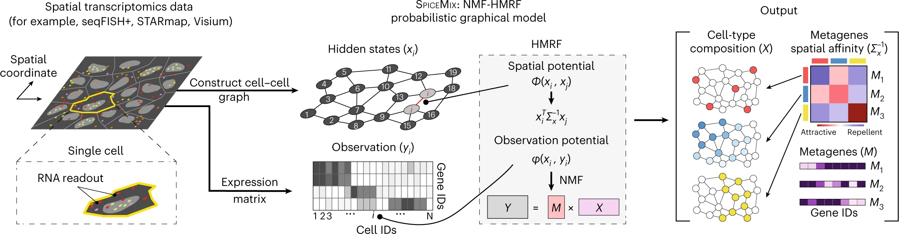

Our paper is now officially published in [___Nature Genetics___](https://doi.org/10.1038/s41588-022-01256-z)

# Overview of SpiceMix



SpiceMix is an unsupervised tool for latent representation learning for spatial transcriptomics. SpiceMix models the observed expression of genes within a cell/spot as a mixture of latent factors. These factors are assumed to have some spatial affinity between neighboring cells. The factors and affinities are not known *a priori*, but are learned by SpiceMix directly from the data. In this way, SpiceMix learns a more expressive representation of the identity of cells from their spatial transcriptome data than other available methods. 

SpiceMix can be applied to any type of spatial transcriptomics data, including MERFISH, seqFISH, and Visium, and other spatial omics data.

## Reproducibility of our Nature Genetics paper

To reproduce the results presented in our Nature Genetics paper, please use the code in branch `NatureGenetics-2022`.

## Major updates since our Nature Genetics paper

After the acceptance of our paper, we further improved the implementation of SpiceMix. We made the following updates:

- SpiceMix no longer depends on Gurobi.
- All backend optimization algorithms are implemented via PyTorch and can utilize GPU.
- A better initialization algorithm based on Louvain clustering is added and is the default choice.

These updates led to a better performance on the Visium dataset for identifying cortical layers and white matter. Specifically, we trained SpiceMix and did clustering on FOVs 151607-151610, following the same procedure as in our paper. The inferred spot annotations got an ARI score of 0.64 when evaluated at the 4 FOVs collectively. When evaluated on each FOV separately, the ARI scores are 0.64, 0.63, 0.66, and 0.69, respectively. Please see [this notebook](./SpiceMix/main_Maynard2021.ipynb) for details.

# Running SpiceMix

## Installation

Python package dependencies:

- PyTorch
- pandas
- scikit-learn
- h5py
- tqdm
- scanpy, python-igraph, louvain
- seaborn
- jupyterlab

An environment file for Anaconda can be found [here](./SpiceMix.yml). An Anaconda environment can be set up with the following command
```
conda env create -f SpiceMix.yml
```

## Running SpiceMix from command line

All code is contained within the SpiceMix folder. The script `main.py` runs the program -- see examples for usage.

### Step 1: Preparing input files

All files for one run of SpiceMix must be put into one directory. SpiceMix can be applied to multiple samples (or replicates, or fields-of-view (FOV)) simultaneously, learning shared parameters across samples (we use the term FOV for an independent sample). For each FOV with name `<FOV>` of `N` cells and `G` genes, the following two files stored as tab-delimited txt format are required for SpiceMix:

- `expression_<FOV>_<expr_suffix>.txt`, an `N`-by-`G` nonnegative-valued matrix of normalized single-cell expression profiles. In our paper, we applied the following steps of normalization to all data sets:
  - Filter out genes with low nonzero rates and/or cells that express only a few genes
  - Log transformation: Let  be the read counts of gene `g` in cell `i`, and the number of counts after log transformation is )
- `neighborhood_<FOV>_<neigh_suffix>.txt`, a neighbor graph represented as a list of cell pairs, i.e., an `|E|`-by-2 integer-valued matrix, where `|E|` is the number of edges in the graph. Cells are assigned with integer indices starting from 0 in the order that they appear in the expression profile file. We recommend the following two methods to generate the neighbor graph from cells' spatial coordinates:
  - K-nearest neighbor graph under Euclidean metric
  - Delaunay triangulation followed by discarding interactions between cells that are far away from each other

The following files for each FOV are required for downstream analysis and visualization:

- `genes_<FOV>_<expr_suffix>.txt`, a multi-line file containing gene IDs or symbols, one gene per line. The order of genes should match that in `expression_<FOV>_<expr_suffix>.txt`.
- `meta_<FOV>.csv`, a comma-separated table with one header line followed by `N` lines, one for each cell. The order of cells must be the same as the `expression_<FOV>_<expr_suffix>.txt` files. It is recommended to include the following columns:
  - `coor X` and `coor Y` that store the spatial coordinate of single cells.
  - `cell type` that stores the reference cell type assignments. Note that additional reference can be included with different column names.
- (Deprecated) ~~`coordinates_<FOV>.txt`, an N-by-2 matrix of single cells' spatial coordinates in the 2D or 3D space. The current tutorial notebook works only with 2D coordinates.~~
- (Deprecated) ~~`celltypes_<FOV>.txt`, a multi-line file containing cell types from other analysis, one cell type per line. The order of cells should match that in `expression_<FOV>_<expr_suffix>.txt`.~~

When there are multiple isolated FOVs, the order of genes in `expression_<FOV>_<expr_suffix>.txt` for all FOVs must be identical.

The FOV name, denoted by `<FOV>` here, is required in order to distinguish between cells from different FOVs, especially when they don't share the same coordinate system. FOV names can be any string, such as '1', 'cortex', 'mouse brain Oct-10-2020'.

To compare different preprocessing approaches, the two suffices, `<expr_suffix>` and `<neigh_suffix>`, can be specified for each normalization and neighbor graph, respectively. For example, `neighborhood_3_10NN.txt` and `neighborhood_3_Delaunay.txt` may denote the neighbor graph of FOV 3 generated by 10-nearest neighbor and Delaunay triangulation, respectively. It is feasible for different preprocessing approaches to use different sets of genes. For example, we may 1) use all genes and set `<expr_suffix>` to `all`, and 2) keep genes that are expressed in at least 10% of cells and set `<expr_suffix>` to `nonzero10`. The two suffices are optional, and the preceding underscore `_` should be absent when the corresponding suffix is not used (an empty string).

### Step 2: Organizing files

We recommend creating one directory for every data set. In the directory, denoted by `<dataset>`, a directory named `files` should be created and all aforementioned input files should be put in this directory.

For example, when we have one dataset, named `simulation 1`, consisting of 3 FOVs, we should arrange the files in the following manner
```
simulation 1
└── files
    ├── expression_1.txt
    ├── expression_2.txt
    ├── expression_3.txt
    ├── neighborhood_1.txt
    ├── neighborhood_2.txt
    ├── neighborhood_3.txt
    ├── genes_1.txt
    ├── genes_2.txt
    ├── genes_3.txt
    ├── meta_1.csv
    ├── meta_2.csv
    └── meta_3.csv
```

When we have another dataset, named `simulation 2`, consisting of 2 FOVs, and we'd like to try different preprocessing approaches - `all` and `nonzero10` for filtering genes and `10NN` and `Delaunay` for generating neighbor graphs. We need to arrange files to 
```
simulation 2
├── files
|   ├── expression_1_all.txt
|   ├── expression_2_all.txt
|   ├── expression_1_nonzero10.txt
|   ├── expression_2_nonzero10.txt
|   ├── neighborhood_1_10NN.txt
|   ├── neighborhood_2_10NN.txt
|   ├── neighborhood_1_Delaunay.txt
|   ├── neighborhood_2_Delaunay.txt
|   ├── genes_1_all.txt
|   ├── genes_2_all.txt
|   ├── genes_1_nonzero10.txt
|   ├── genes_2_nonzero10.txt
|   ├── meta_1.txt
|   └── meta_2.txt
└── some other directories // SpiceMix discards any other directories
```

### Step 3: Inferring latent states, metagenes, and pairwise affinity matrix

SpiceMix requires a few arguments to specify the input files and hyperparameters. Below is the table of the description of all arguments:

#### Input related parameters
| params | type | description | example |
|-|-|-|-|
| --path2dataset      | str | path to the dataset | "../data/simulation 1" or "../data/synthetic_cortex" |
| --neighbor_suffix   | str | suffix of the name of the file that contains interacting cell pairs | "", "KNN", or "Delaunay" |
| --expression_suffix | str | suffix of the name of the file that contains expressions | "", "allgenes", or "top100genes" |
| --repli_list        | list of strings (Python expression)  | A Python expression of a list of FOV names | "[0,1,2]", "[A,B]", or "range(3)" |
| --use_spatial       | list of booleans (Python expression) | A Python expression of a list of boolean variables controlling whether to use the neighbor graph for each FOV | "[True,True,True]", "[False]*5", or "[True,False,True]" |

#### Hyperparameters

| params | type | description | example |
|-|-|-|-|
| -K                      | int | number of metagenes; equivalently, dimension of latent space | 15 |
| --initialization_method | str | Supports `louvain`, `kmeans`, `svd`, and `precomputed clusters` | "louvain" |
| --initialization_kwargs | dict (Python expression) | A dictionary specifying arguments for the initialization | "dict()" |
| --lambda_SigmaXInv      | float | regularization on Sigma_x^{-1} | 1e-6 |
| --max_iter              | int | maximum number of coordinate optimization iterations | 200 |
| --init_NMF_iter         | int | number of NMF iterations for initialization of SpiceMix | 10 |

#### Reproducibility related parameters
| params | type | description | example |
|-|-|-|-|
| --random_seed | int | the initial random seed fed to k-means | 0 |

#### Output control
| params | type | description | example |
|-|-|-|-|
| --result_filename | str | the name of the hdf5 file that stores inferred parameters | "../data/simulation 1/results/SpiceMix.h5" |

#### Examples
The following command runs SpiceMix on FOVs 1 and 3 from dataset `simulation 1` with `K=20` metagenes and the spatial information of both FOVs are used:
```
python main.py -K=20 --dataset="path/to/simulation 1" --repli_list="[1,3]" --use_spatial="[True]*2" --result_filename="path/to/simulation 1/results/SpiceMix_K20_FOV13.h5"
```
To run NMF on FOVs 1 and 3 on the same dataset with identical settings, we can use the following command:
```
python main.py -K=20 --dataset="path/to/simulation 1" --repli_list="[1,3]" --use_spatial="[False]*2" --result_filename="path/to/simulation 1/results/NMF_K20_FOV13.h5"
```

To specify the files generated by a particular preprocessng approach for dataset `simulation 2`, we can run
```
python main.py -K=20 --dataset="path/to/simulation 2" --repli_list="[1,2]" --use_spatial="[True]*2" --neighbor_suffix=10NN --expression_suffix=nonzero10 --result_filename="path/to/simulation 2/results/SpiceMix_K20_FOV12_10NN_nonzero10.h5"
```
and
```
python main.py -K=20 --dataset="path/to/simulation 2" --repli_list="[1,2]" --use_spatial="[False]*2" --neighbor_suffix=10NN --expression_suffix=nonzero10 --result_filename="path/to/simulation 2/results/NMF_K20_FOV12_10NN_nonzero10.h5"
```

### Step 4: Locating results

The output of one SpiceMix run is saved in an HDF5 file in the `results` directory and its name is specified via the argument to `--result_filename`. In an HDF5 file, there are four groups and the content is organized in the following structure:

- `hyperparameters`: Hyperparameters specified for this run. For example,
  - `hyperparameters/K`: the number of metagenes;
  - `hyperparameters/lambda_SigmaXInv`: the value of the regularization coefficent on `Sigma_x^{-1}`;
  - `hyperparameters/repli_list`: the list of replicate names.
- `metrics`: Criterion of convergence. Currently, only one indicator of convergence is implemented:
  - `metrics/Q/{i}`: the Q-value after the `i`th iteration, which is the negative logarithm of the joint probability.
- `latent_states`: Latent states, currently only including `X` for each FOV.
  - `latent_states/XT/{repli_name}/{i}`: an N-by-K matrix containing the latent states in replicate `<repli_name>` after iteration `i`.
- `parameters`: Model parameters:
  - `parameters/M/{i}`: a `G`-by-`K` matrix containing the metagenes after iteration `i`;
  - `parameters/Sigma_x_inv/{i}`: a `K`-by-`K` matrix containing the affinity matrix `Sigma_x^{-1}` after iteration `i`;

## Empirical runtime

- On a synthetic dataset, SpiceMix takes 6~30 minutes for 200 iterations, depending on the difficulty.
- On the Visium dataset (Maynard 2021), SpiceMix takes 100 minutes for 200 iterations.

# Cite

Cite our paper by

```
@article{chidester2023spicemix,
  title={SpiceMix enables integrative single-cell spatial modeling of cell identity},
  author={Chidester, Benjamin and Zhou, Tianming and Alam, Shahul and Ma, Jian},
  journal={Nature Genetics},
  pages={1--11},
  year={2023},
  publisher={Nature Publishing Group},
  doi={https://doi.org/10.1038/s41588-022-01256-z},
}

```


# Contact

Please contact tianming@andrew.cmu.edu or raise an issue in the github repo with any questions about installation or usage.
